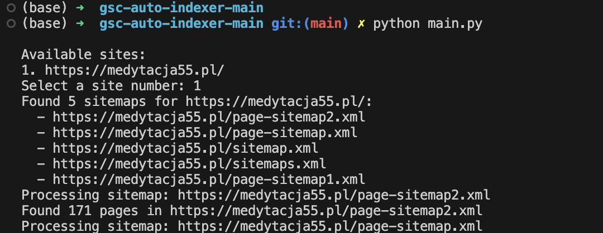
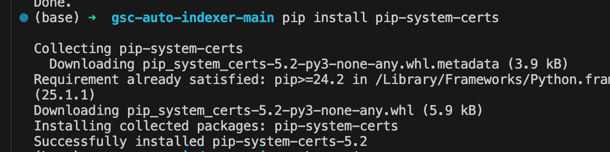

## Google Search Console Auto-Indexer (`gsc-auto-indexer`)

This Python script automatically submits URLs from your website to Google Search Console for indexing or re-indexing. It offers a free alternative to paid SEO tools for managing your website's search engine visibility.

## Thanks

Thanks to the original code creator: https://github.com/oslook/gsc-auto-indexer 


I have improved on top of his work as I had to cover case for multiple XML sitemaps to position in google:



**Key Features:**

* Connects to your Google Search Console using a Google Cloud Service Account.
* Parses your website's sitemap to identify all URLs.
* Submits each URL for indexing in Google Search Console.

**Getting Started**

In case of doubts follow this instructions to the letter:
https://developers.google.com/search/apis/indexing-api/v3/prereqs 

Setting up this script is straightforward:

1. **Install Dependencies:**
   Ensure you have Python 3 and `pip` installed. Run the following command in your terminal to install the required libraries:

   ```bash
   pip install -r requirements.txt
   ```

2. **Clone the Repository:**
   Clone this script's repository using Git:

   ```bash
   git clone https://github.com/oslook/gsc-auto-indexer.git  # Replace 'username' with your GitHub username
   cd gsc-auto-indexer
   ```

3. **Create a Google Cloud Service Account:**
   - Visit the Google Cloud Console ([https://console.cloud.google.com/](https://console.cloud.google.com/)) and navigate to the IAM & Admin section.
   - Create a new service account and download the JSON key file. Move this file to the script's directory.

4. **Authenticate the Script:**
   - Open the script (`main.py`) in a text editor.
   - Update the `SERVICE_ACCOUNT_FILE` variable with the exact filename of your downloaded JSON key file. 

5. **Grant Permissions in Google Search Console:**
   - Access your Google Search Console dashboard.
   - Navigate to "Settings" > "Users and Permissions" > "Add User."
   - Enter the email address associated with your service account (found in the key file) and grant it "Owner" permissions.

**Running the Script:**

Execute the script using Python:

```bash
python main.py
```

The script will:

* List all websites associated with your service account in Google Search Console.
* Prompt you to choose a website for indexing.
* Parse the website's sitemap (fetched from Search Console) and extract URLs.
* Ask for confirmation before submitting URLs for indexing.
* Submit each URL to Google Search Console and display indexing status information.

**Optional Configuration**

The script provides an optional flag (`INDEX_FROM_CSV`) for specifying a CSV file (`urls.csv`) containing a list of URLs to index instead of using the website's sitemap.

**Important notes**
1. SSL Certificate error:

If you encounter this error locally:


Please do use:


2. Sitemap URL:
In my case part of the problem with indexing was wrong sitemap format/URL.

Originally I had sitemap generated by some plugin to match domain.com/sitemaps.xml.
When I used other that generated sitemap.xml AND it's format was more XML like it solved the issue.
I think it is important to see different sitemal.xml version AND how the Google Search Console treats it.

